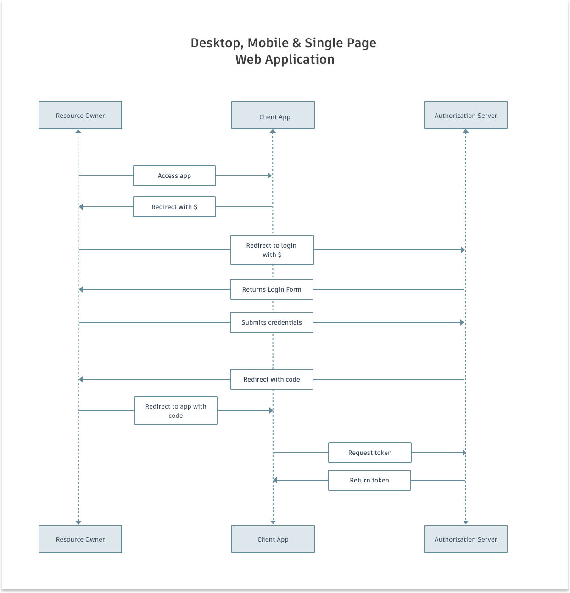
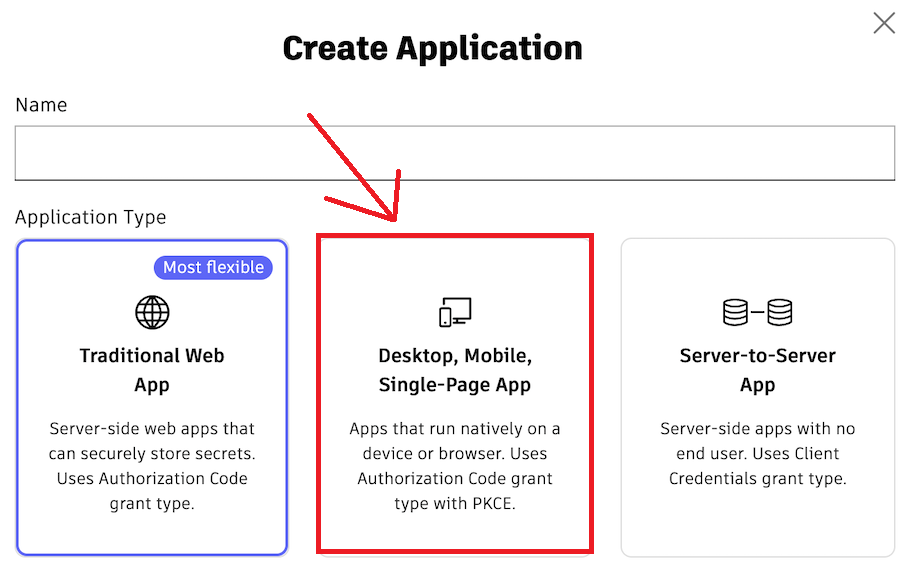

# Demo Revit Add-in Autodesk Desktop Authentication PKCE

Introduction The purpose of this sample is demonstrate a quick way to test and obtain your three legged tokens using PKCE method in the context of a single page app (you can refer here for more [details](https://aps.autodesk.com/en/docs/oauth/v2/tutorials/get-3-legged-token-pkce/)).

## Description

The add-in is a simple Revit add-in that will authenticate with Autodesk Desktop Authentication using PKCE method. The add-in will open a browser window to authenticate with Autodesk Desktop Authentication. Once authenticated, the add-in will obtain the access token and refresh token and store them in the Revit document.

## Usage

- Create a application from website [`aps.autodesk.com`](https://aps.autodesk.com/)

- Copy the `client_id` to `Resources.resx`

- Create a callback URL in the format `http://localhost:8080/api/auth/callback` and add it to the `Redirect URIs` in the application settings, and then add it to the `Resources.resx`

- Debug the add-in and run command demo example to see the authentication process and token.

## Video Demo 

## License MIT

The repository is licensed under the MIT license. For more information see the [LICENSE](LICENSE) file.

## Learning Resources

- Github 3Leg CSharp - https://github.com/chuongmep/aps-toolkit-3leg-csharp
- Auth PKCE Csharp - https://github.com/chuongmep/aps-tookit-auth-3leg-pkce
- https://github.com/ricaun-io/ricaun.Revit.UI.Tasks
- https://github.com/autodesk-platform-services/aps-pkce-desktop-app
- https://github.com/autodesk-platform-services/aps-pkce-webapp
- https://aps.autodesk.com/blog/new-application-types
- https://github.com/JoaoMartins-callmeJohn/PKCE-TEST